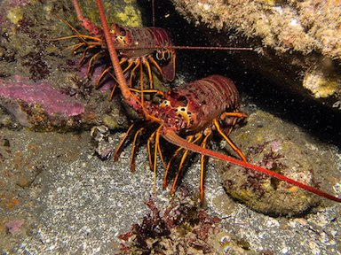

---
# title:"ESM 203 ASSIGNMENT 4"
# author: "Leana Goetze"
# date: "11/11/2019"
# output: html_document
---

```{r setup, include=FALSE}
knitr::opts_chunk$set(warning = FALSE, message = FALSE, echo = FALSE)
```

<center>
## Impact of Marine Protected Area Establishment on California Spiny Lobster Populations
</center>
#### Leana Goetze
#### 11/18/2019

<center>
</center>

### I. Introduction

California Spiny Lobsters are vital to kelp forest ecosystems. By consuming sea urchins, California Spiny Lobsters ensure that sea urchin populations do not grow out of hand and overconsume kelp from these forests. However, the average size and lifespan of these lobsters has been declining over the past century, largely due to overfishing (Haw 2012). In 2012, the California Department of Fish and Wildlife established Marine Protected Areas (MPA) around the Naples and Isla Vista Santa Barbara Coastal Long Term Ecological Research (SBC LTER) study sites (Reed 2019). MPAs restrict human activities, such as fishing, within certain regions of the ocean to conserve habitat and biodiversity (CDFW). The established MPAs have significant potential to protect and restore California Spiny lobsters populations back to their orginal populations. Here, we use data collected by the Santa Barbara Coastal Long Term Ecological Research team to compare California Spiny Lobster sizes and abundances from lobsters observed at both MPA and non-MPA sites during the first five years after the establishment of the Naples and Isla Vista MPAs (2012-2018).

### II. Data and Methods
Data on California Spiny Lobster abundance and size from 2012-2018 were collected and provided by the [Santa Barbara Coastal Long Term Ecological Research](https://sbclter.msi.ucsb.edu) program. Lobster abundance is estimated from lobster counts obtained annually by divers. Data on lobster size were obtained by measuring the length of lobsters (mm) when original counts were obtained. For more information on data collection procedures, and the project as a whole, see [metadata](https://portal.lternet.edu/nis/metadataviewer?packageid=knb-lter-sbc.77.3).  The Isla Vista and Naples study sites have been grouped together under "MPA", as both of these sites are located within California Fish and Game Network of Marine Protected Areas. The three other SBC LTER study sites, Arroyo Quemado, Mohawk and Carpinteria, do not fall under these protections and have been grouped together under the "non-MPA" designation. Four two-sample t-tests using 95 % confidence intervals (α= 0.05) were ran to compare lobster size differences between a) MPA and non-MPA sites in 2012 b) MPA and non-MPA sites in 2018 c) 2012 and 2018 across MPA sites and d) 2012 and 2018 across non-MPA sites. Effect Size was measured with cohen's d tests. All analyses and figures were prepared using R software (version 3.6.1).

### III. Results

##### A. *Lobster Abundance*
```{r}
# attach packages
library(tidyverse)
library(janitor)
library(tidyr)
library(gghighlight)
library(dplyr)
library(plotly)
library(directlabels)
library(DT)
library(effsize)
library(kableExtra)
library(egg)
```

```{r}
# read in data frame 
lobster <- read_csv("lobster_abundance_sbc_lter.csv", na = "-99999") 

# clean up headers and uncount data so that each lobster is represented in its own row
lobster_clean <- lobster %>% 
  janitor::clean_names() %>% 
  uncount(count)
```


```{r}
# count data by site and year to determine the total sample size (lobster count) at each site, during each year
lobster_ys <- lobster_clean %>% 
  count(year, site)
```

```{r}
# create graph to show how lobster counts changed over the years accross the five sites. Highlight the two MPA sites using gghighlight and add other customizations
ggplot(lobster_ys, aes(x = year, y = n, group = site))+
  geom_line(show.legend = FALSE, color = "maroon")+
  geom_point(show.legend = FALSE, color = "maroon") +
  labs(title = "Annual Lobster Abundance By Site", x = "Year", y = "Lobster Counts") +
  theme_minimal() +
  gghighlight(site %in% c("IVEE","NAPL"), label_key = NONE,unhighlighted_colour = "lightskyblue4") +
  theme(plot.title = element_text(hjust= 0.5,
                                  face = "bold",
                                  size = 16,
                                  margin=margin(0,0,10,0))) +
  theme(axis.title.x = element_text (face = "bold",
                                     size = 14,
                                     margin=margin(10,0,0,0))) +
  theme(axis.title.y = element_text (face = "bold",
                                     size = 14,
                                     margin=margin(0,10,0,0)))+
  expand_limits(x = c(2012, 2019))+
  annotate("text", x = 2018.4, y = 946, label = "Isla Vista", size = 3, color = "maroon")+
  annotate("text", x = 2018.4, y = 343, label = "Carpinteria", size = 3, color = "lightskyblue4") +
  annotate("text", x = 2018.3, y = 298, label = "Naples", size = 3, color = "maroon")+
  annotate("text", x = 2018.4, y = 164, label = "Mohawk", size = 3, color = "lightskyblue4") +
  annotate("text", x = 2018.6, y = 54, label = "Arroyo Quemado", size = 3, color = "lightskyblue4")

```
  
**Figure 1. Annual California Spiny Lobster abundances at five sites along the
Santa Barbara Channel (2012-2018).** Lobster counts were obtained annually at five SBC LTER kelp forest study sites. Points indicate individual counts obtained. Two of the five sites, highlighted in maroon, are designated Marine Protected Areas (Naples and Isla Vista). Data: [Santa Barbara Coastal LTER](https://portal.lternet.edu/nis/mapbrowse?packageid=knb-lter-sbc.77.3)

Most recently between 2017-2018, the only two sites that experienced an increase in lobster abundance were the Naples and Isla Vista sites. This is significant to note because both the Naples and Isla Vista SBC LTER study sites are established marine protected areas. The other three sites do not fall under such protections. Both Naples and Isla Vista were established as Marine Protected Areas in 2012, and both experienced an increased abundance of California Spiny Lobsters up until 2015, when the lobster populations dropped quite rapidly, due to an unknown cause. While lobster populations at the Isla Vista site were able to recover quite rapidly during 2016, the abundance of lobsters at the Naples site did not surpass their 2015 abundance levels until this past year (Figure 1).

##### B. *Lobster Size*

```{r, fig.height = 11}
# select specific columns from original data and filter only the years in question (2012 & 2018). Change "year" to a character class for easier graphing. 
lobster_whisker <- lobster_clean %>% 
  select (year, size_mm, site) %>% 
  filter (year %in%  c("2012", "2018"))%>% 
  group_by(year, size_mm) %>%  
  mutate(year_updated = as.character(year)) 

# rename site names to full names (not abbreviations)
lobster_whisker$site[lobster_whisker$site == "AQUE"] <-"Arroyo Quemado (AQUE)"
lobster_whisker$site[lobster_whisker$site == "NAPL"] <-"Naples (NAPL)"
lobster_whisker$site[lobster_whisker$site == "IVEE"] <-"Isla Vista (IVEE)"
lobster_whisker$site[lobster_whisker$site == "MOHK"] <-"Mohawk (MOHK)"
lobster_whisker$site[lobster_whisker$site == "CARP"] <-"Carpinteria (CARP)"

# summarize the mean lobster size at each site and year
lobster_whisker_mean <- lobster_whisker %>% 
  select(-year) %>% 
  group_by(year_updated,site) %>% 
  summarize(mean= mean(size_mm)) 

#create a data frame to label individual facets
ann_text <-data.frame(year_updated = c("2018", "2018"), size_mm = c(185, 185), site = c("Isla Vista (IVEE)","Naples (NAPL)"), label = c("*MPA*", "*MPA*"))

# create a box and whisker plot to graph the size distrubtion shifts between the two years and across the five sites. Add jitter plot to show individual size measurements. Add means to the graph with the geom_hline() function. 
ggplot(lobster_whisker, aes(x=year_updated, y=size_mm, fill = year_updated)) + 
  geom_boxplot(show.legend = FALSE) +
  scale_fill_manual(values = c("#00AFBB", "#E7B800"))+
  geom_jitter(show.legend = FALSE,alpha = .3, size=.3)+
  facet_wrap(~site) +
   labs(title = "Average Lobster Size Across Five Sample Sites \n (2012 vs. 2018)", x = "Year", y = "Lobster Size (mm)") +
  theme(plot.title = element_text(hjust= 0.5,
                                  face = "bold",
                                  size = 16,
                                  margin=margin(0,0,15,0))) +
  theme(axis.title.x = element_text (face = "bold",
                                     size = 14,
                                     margin=margin(10,0,0,0))) +
  theme(axis.title.y = element_text (face = "bold",
                                     size = 14,
                                     margin=margin(0,10,0,0))) +
  scale_y_continuous( expand = c(0,0), limits = c(40,190))+
  geom_hline(data=lobster_whisker_mean, aes(yintercept=mean, color = year_updated), show.legend = FALSE, linetype = "dashed", size = .5) +
  scale_color_manual(name="year_updated", values=c("#00AFBB", "#E7B800")) +
  geom_text(data = ann_text,label=ann_text$label, color = "maroon", size = 5.3)


  
```


```{r}
# explore population sizes
lobster_ys2 <- lobster_ys %>% 
  filter( year %in% c("2012", "2018"))
```

**Figure 2. California Spiny Lobster size distributions 2012 vs. 2018.** Size measurements, length in mm,  of California Spiny Lobsters were taken annually at five California coastal sites. Individual size measurements are plotted as points in addition to distribution metrics. Medians are represented by solid black lines, while means are indicated by dashed lines (blue = 2012, yellow = 2018). The Naples and Isla Vista study sites are designated Marine Protected Areas, as noted in maroon. Data: [Santa Barbara Coastal LTER](https://portal.lternet.edu/nis/mapbrowse?packageid=knb-lter-sbc.77.3)

The Isla Vista and Naples study sites, both MPA sites, experienced the greatest increase in mean lobster sizes between 2012 and 2018 (`r round(lobster_whisker_mean$mean[8]-lobster_whisker_mean$mean[3],2)` mm and `r round(lobster_whisker_mean$mean[10]-lobster_whisker_mean$mean[5],2)` mm respectively). Non-MPA study sites experienced slight increases in mean lobster size at both the Arroyo Quemado site (`r round(lobster_whisker_mean$mean[6]-lobster_whisker_mean$mean[1],2)` mm) and at the Carpinteria site (`r round(lobster_whisker_mean$mean[7]-lobster_whisker_mean$mean[2],2)` mm), but experienced a decrease by `r round(lobster_whisker_mean$mean[4]-lobster_whisker_mean$mean[9],2)` mm in mean lobster length at the Mohawk site. Median lobster sizes at these sites followed the same trends when comparing across 2012 and 2018. Both the Isla Vista and Naples sites experienced greater ranges of lobster sizes in 2018 than in 2012, while ranges in lobster sizes at the non-MPA study sites remained relatively constant or decreased during this same time frame (Figure 2).


#####  C. *MPA vs. non-MPA comparison*

**Table 1: California Spiny Lobster size metrics (MPA vs. nonMPA)**
```{r}
# Add a "designation" column and label each site as either "MPA" or "nonMPA"
lobster_partc<- lobster_clean  %>% 
  select (year, size_mm, site) %>% 
  filter (year %in% c("2012", "2018")) %>% 
  dplyr::mutate(
    designation = dplyr::case_when(
      site %in% c("IVEE", "NAPL") ~ "MPA",
      site %in% c("AQUE", "MOHK", "CARP") ~ "non-MPA"))

 # create a summary table of mean, sd, and sample size for each group (group by designation and year)
lobster_summary <- lobster_partc %>% 
  group_by(year, designation) %>% 
  summarize(
    Mean_Size_mm = round(mean(size_mm, na.rm = TRUE), 2),
    Standard_Deviation = round(sd(size_mm, na.rm = TRUE), 2),
    Sample_Size = n()
  ) 

```


```{r}
# create a data table using kable function and add customizations
lobster_summary %>% 
  kable(col.names = c("Year", 
                      "Site Designation",
                      "Mean Size (mm)",
                      "Standard Deviation",
                      "Sample Size")) %>% 
  kable_styling(bootstrap_options = "bordered", 
                full_width = F,
                position = "left") %>% 
  row_spec(1, background = "seashell") %>% 
  row_spec(3, background = "seashell") 


```

```{r}
# a. 2012 MPA vs. nonMPA
# run t-test
MPA_sample_2012 <- lobster_partc %>% 
  filter(designation == "MPA", year == "2012") %>% 
  pull(size_mm)

nonMPA_sample_2012 <- lobster_partc %>% 
  filter(designation == "non-MPA", year == "2012") %>% 
  pull(size_mm)

MPA_nonMPA_2012 <- t.test(MPA_sample_2012, nonMPA_sample_2012)
#MPA_nonMPA_2012
# p <.001 --> reject null

#run cohen's d test to test for effect size
MPA_sample_2012_2 <- lobster_partc %>% 
  filter(designation == "MPA", year == "2012") 

nonMPA_sample_2012_2 <- lobster_partc %>% 
  filter(designation == "non-MPA", year == "2012") 
 

MPA_nonMPA_2012_d <- effsize::cohen.d(MPA_sample_2012_2$size_mm, nonMPA_sample_2012_2$size_mm, na.rm = TRUE)

#MPA_nonMPA_2012_d
#effect size = medium --> medium difference in means 
```

```{r}
# b. 2018 MPA vs. nonMPA
# run t-test
MPA_sample_2018 <- lobster_partc %>% 
  filter(designation == "MPA", year == "2018") %>% 
  pull(size_mm)

nonMPA_sample_2018 <- lobster_partc %>% 
  filter(designation == "non-MPA", year == "2018") %>% 
  pull(size_mm)

MPA_nonMPA_2018 <- t.test(MPA_sample_2018, nonMPA_sample_2018)
#MPA_nonMPA_2018
# p is very small --> rejet null 

# run cohen's d to test for effect size
MPA_sample_2018_2 <- lobster_partc %>% 
  filter(designation == "MPA", year == "2018") 
  
nonMPA_sample_2018_2 <- lobster_partc %>% 
  filter(designation == "non-MPA", year == "2018") 
  
MPA_nonMPA_2018_d <- effsize::cohen.d(MPA_sample_2018_2$size_mm, nonMPA_sample_2018_2$size_mm, na.rm = TRUE)

#MPA_nonMPA_2018_d 
# cohen's d is small (ish) so eventhough rejected null, statistical sig could be due to population size. although mean difference is still about 4 mm
```
In 2012, California Spiny Lobsters from sites within MPAs and lobsters from non-MPA sites differed in size by an average of `r round(MPA_nonMPA_2012$estimate[2]-MPA_nonMPA_2012$estimate[1],2)` mm, with a medium effect size (Cohen’s d = `r abs(round(MPA_nonMPA_2012_d$estimate[1],2))`). Lobsters from non-MPA sites were on average `r abs(round((MPA_nonMPA_2012$estimate[2]-MPA_nonMPA_2012$estimate[1])/MPA_nonMPA_2012$estimate[1] * 100,2))`% larger than lobsters found within MPAs. This difference is statistically significant (t(`r round(MPA_nonMPA_2012$parameter, 2)`) = `r round(MPA_nonMPA_2012$statistic, 2)`, *p* < 0.001). In contrast to 2012, in 2018 we find that lobsters within MPAs are on average larger than lobsters found at non-MPA sites. Lobsters found within MPAs are on average `r abs(round((MPA_nonMPA_2018$estimate[2]-MPA_nonMPA_2018$estimate[1])/MPA_nonMPA_2018$estimate[1] * 100,2))`% larger than lobsters from non-MPA sites. Although the effect size is small, (Cohen’s d = `r abs(round(MPA_nonMPA_2018_d $estimate[1],2))`), lobster size, on average, still differed by `r round(MPA_nonMPA_2018$estimate[1]-MPA_nonMPA_2018$estimate[2],2)` mm, with statistical significance (t(`r round(MPA_nonMPA_2018$parameter, 2)`) = `r round(MPA_nonMPA_2018$statistic, 2)`, *p* < 0.001).
```{r}
#c. MPA 2012 vs. 2018
# run t test
MPA_2012 <- lobster_partc %>% 
  filter(designation == "MPA", year == "2012") %>% 
  pull(size_mm)

MPA_2018 <- lobster_partc %>% 
  filter(designation == "MPA", year == "2018") %>% 
  pull(size_mm)

MPA_2012_2018 <- t.test(MPA_2012, MPA_2018)
#MPA_2012_2018
# p value <.001 --> reject null

# run cohen's d to test for effect size
MPA_2012_2 <- lobster_partc %>% 
  filter(designation == "MPA", year == "2012") 

MPA_2018_2 <- lobster_partc %>% 
  filter(designation == "MPA", year == "2018") 

MPA_2012_2018_d <- effsize::cohen.d(MPA_2012_2$size_mm, MPA_2018_2$size_mm, na.rm = TRUE)

#MPA_2012_2018_d
# large effect size--> large difference in means (def reject null)
```

```{r}
#d. non-MPA 2012 vs. 2018
# run t test
nonMPA_2012 <- lobster_partc %>% 
  filter(designation == "non-MPA", year == "2012") %>% 
  pull(size_mm)

nonMPA_2018 <- lobster_partc %>% 
  filter(designation == "non-MPA", year == "2018") %>% 
  pull(size_mm)

nonMPA_2012_2018 <- t.test(nonMPA_2012, nonMPA_2018)
#nonMPA_2012_2018
# p value >.05 --> DO NOT REJECT NULL

# run cohen's d to test for effect size
nonMPA_2012_2 <- lobster_partc %>% 
  filter(designation == "non-MPA", year == "2012") 

nonMPA_2018_2 <- lobster_partc %>% 
  filter(designation == "non-MPA", year == "2018") 

nonMPA_2012_2018_d <- effsize::cohen.d(nonMPA_2012_2$size_mm, nonMPA_2018_2$size_mm, na.rm = TRUE)

#nonMPA_2012_2018_d 
# very small cohen's d--> small cohen's size (fits with not rejecting null)
```
California Spiny lobsters sampled from sites within MPAs significantly differed in size from 2012 to 2018 (t(`r round(MPA_2012_2018$parameter, 2)`) = `r round(MPA_2012_2018$statistic, 2)`, *p* < 0.001). Individuals measured in 2018 were on average `r abs(round((MPA_2012_2018$estimate[2]-MPA_2012_2018$estimate[1])/MPA_2012_2018$estimate[1] * 100,2))`% larger in size than those measured in 2012, with an average difference of `r round(MPA_2012_2018$estimate[2]-MPA_2012_2018$estimate[1],2)` mm in length, with a large effect size (Cohen’s d = `r abs(round(MPA_2012_2018_d$estimate[1],2))`). In contrast to lobsters measured from sites within MPAs, lobsters measured from non-MPA designated sites did not significantly differ in size between 2012 and 2018 (t(`r round(nonMPA_2012_2018$parameter, 2)`) = `r round(nonMPA_2012_2018$statistic, 2)`, *p* = `r round(nonMPA_2012_2018$p.value,2)`), with a negligible effect size (Cohen’s d = `r abs(round(MPA_2012_2018_d$estimate[1],2))`).

### IV. Summary
- Since 2017, lobster abundances have increased at MPA sites and have decreased at non-MPA sites (Figure 1)
- From 2012 to 2018, the greatest average increases in lobster size have occured at MPA sites (Figure 2)
- Lobsters at MPA sites were 15.13% larger in 2018 than they were in 2012 (Table 1)
- Lobsters at non-MPA sites have not differed significantly in size from 2012 to 2018 (Table 1)

### V. References

**Reed, D. 2019**. SBC LTER: Reef: Abundance, size and fishing effort for California Spiny Lobster (Panulirus interruptus), ongoing since 2012. Environmental Data Initiative. https://doi.org/10.6073/pasta/a593a675d644fdefb736750b291579a0. Dataset accessed 11/16/2019.

**Haw, Jim.(2012)** “USC Dornsife Scientific Diving: The California Spiny Lobster.” *Scientific American Blog Network*. [blogs.scientificamerican.com/expeditions/usc-dornsife-scientific-diving-the-california-spiny-lobster/](blogs.scientificamerican.com/expeditions/usc-dornsife-scientific-diving-the-california-spiny-lobster/).

**California Department of Fish and Wildlife.** *California Marine Protected Areas (MPAs)* https://www.wildlife.ca.gov/Conservation/Marine/MPAs/FAQs#27530610-what-are-marine-protected-areas-mpas-.


